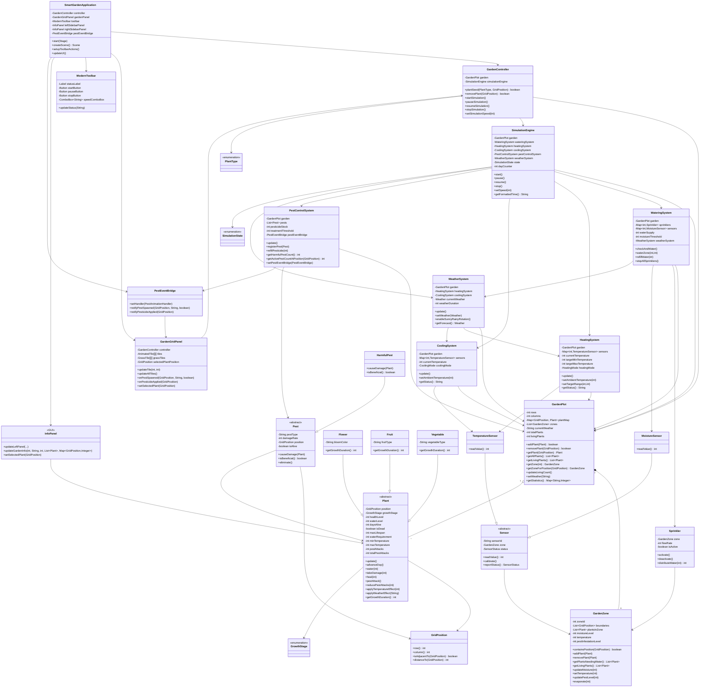

# GUI Simulation Class Diagram

Scope: only the garden GUI simulation flow is kept. API-related classes such as `GardenSimulationAPI`, `GardenSimulator`, and `HeadlessSimulationEngine` are intentionally excluded.

