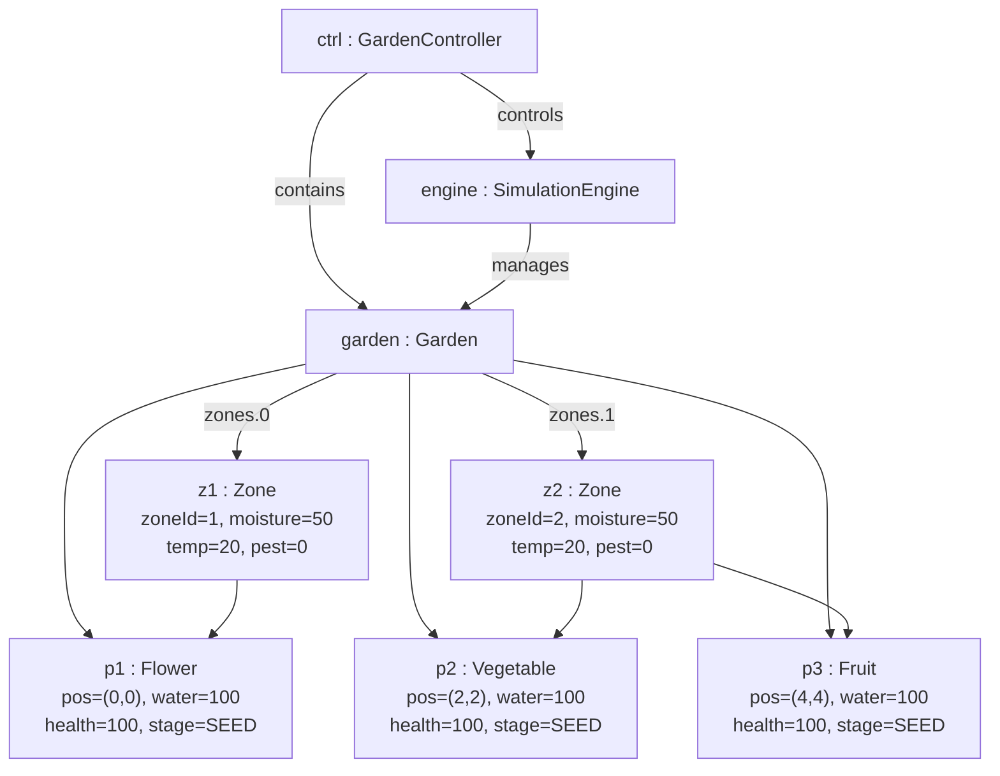
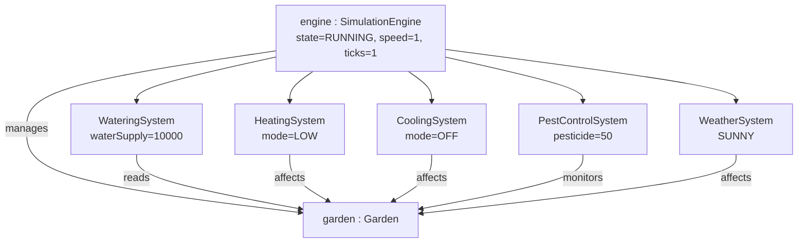
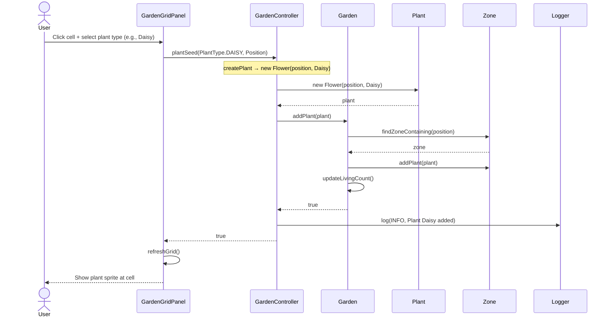
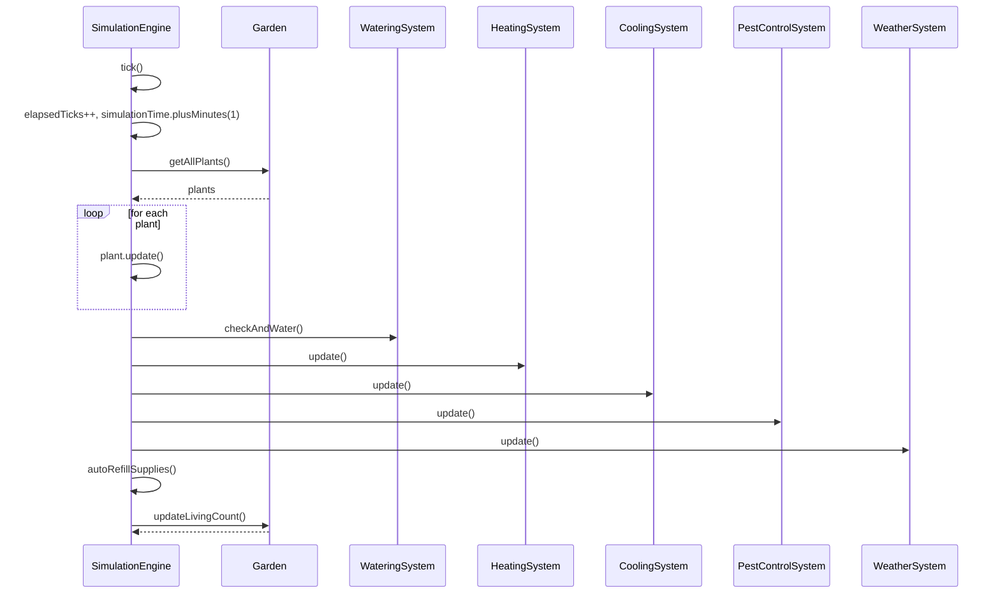

# 5.6 Object Diagram (10 points)

## Overview

An Object Diagram shows object instances and their relationships at a specific moment in time—a "runtime snapshot" of the class diagram. This section presents the object layout of the Smart Garden system during **early simulation** (after the first tick).

## 5.6.1 Scenario

**Scenario**: The user has planted 3 plants (1 flower, 1 vegetable, 1 fruit), clicked Start, and the first simulation tick has completed.

**Key Objects**:
- `ctrl`: `GardenController` – controller
- `garden`: `Garden` – garden model
- `engine`: `SimulationEngine` – simulation engine
- `z1`, `z2`: `Zone` – zones (2 shown)
- `p1`, `p2`, `p3`: `Plant` (Flower, Vegetable, Fruit)
- Subsystems: `wateringSystem`, `heatingSystem`, `coolingSystem`, `pestControlSystem`, `weatherSystem`

## 5.6.2 Object Diagram – Core Domain Model

## 5.6.3 Object Diagram – System Components

## 5.6.4 Object Diagram Summary

| # | Type | Description |
|---|------|-------------|
| 1 | Core Domain Object Diagram | Objects and links among Garden, Zone, Plant, Controller, and Engine at simulation start |
| 2 | System Components Object Diagram | Instance relationships between SimulationEngine and WateringSystem, HeatingSystem, CoolingSystem, PestControlSystem, WeatherSystem |

**Total: 2 object diagrams**, covering **domain objects** and **system components**.

---

# 5.7 Communication and/or Sequence Diagram (10 points)

## Overview

Sequence diagrams describe the interaction order between objects over time. This section references existing project sequence diagrams and adds two new ones: **Plant Seed** and **Simulation Tick**.

## 5.7.1 Existing Sequence Diagrams (docs/design)

| # | File | Scenario |
|---|------|----------|
| 1 | `SequenceDiagram_StartSimulation.puml` | User clicks Start → View → Controller → SimulationEngine → subsystem initialization |
| 2 | `SequenceDiagram_PestControl.puml` | Pest control within a tick: spawn → detect → assess → applyTreatment → damage |
| 3 | `SequenceDiagram_AutomaticWatering.puml` | Automatic watering within a tick: checkMoisture → Sprinkler → Plant.water() |

## 5.7.2 Plant Seed Sequence Diagram

## 5.7.3 Simulation Tick Sequence Diagram (High-Level)

## 5.7.4 Sequence Diagram Summary

| # | Type | Description |
|---|------|-------------|
| 1 | Start Simulation | User → View → Controller → SimulationEngine → subsystem initialization (existing) |
| 2 | Pest Control | SimulationEngine → PestControlSystem → Zone/Plant/Pest (existing) |
| 3 | Automatic Watering | SimulationEngine → WateringSystem → Zone/Sensor/Sprinkler/Plant (existing) |
| 4 | Plant Seed | User → GardenGridPanel → GardenController → Garden → Zone (added in this section) |
| 5 | Simulation Tick | Order of SimulationEngine calls to subsystems per tick (added in this section) |

**Total: 5 sequence diagrams**—3 from `docs/design`, 2 added in this section.
